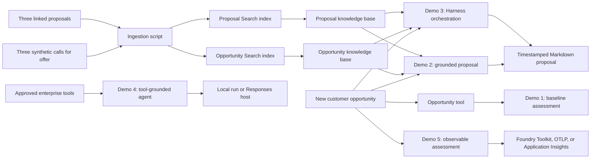

# Opportunity Assessment Agent

A compact Microsoft Agent Framework and Microsoft Foundry demo for turning a customer opportunity into an enterprise-ready solution assessment. The samples show the progression from model-only reasoning to organizational grounding with Foundry IQ, enterprise tools, hosted execution, and observability.

The included healthcare records and opportunity details are synthetic. The project is intended for demonstrations and learning, not as production clinical software.

> Foundry IQ integration uses the `2026-05-01-preview` Azure AI Search API and a beta Azure Search SDK. Review preview compatibility before production use.

## What this repository demonstrates

1. **Single-agent assessment** - Publishes a prompt agent that calls an Agent Framework tool to read the opportunity and create a concise brief.
2. **Foundry IQ proposal generation** - Uses hybrid agentic retrieval to match prior opportunities, retrieves their linked proposals, and writes a cited draft.
3. **Enterprise tools and hosting** - Grounds an agent in CRM, architecture, and cost-profile tools and can expose the agent through the Foundry Responses protocol.
4. **Evaluation and tracing** - Exports Agent Framework traces and records a simple enterprise-coverage score.

## How it works



The Foundry IQ path is deliberately separate from model generation:

- `ingest_foundry_iq.py` creates separate opportunity and proposal indexes with semantic ranking, vectors, Azure OpenAI query-time vectorizers, knowledge sources, and planner-backed knowledge bases.
- `02_patterns.py` builds an explicit Agent Framework workflow graph with four nodes and three edges: opportunity retrieval → linked-proposal retrieval → proposal drafting → Sources assembly.
- The assessment agent receives both the new opportunity and retrieved evidence. Historical claims use citations such as `[0]`, while unsupported choices are labeled as recommendations or assumptions. The script prints only the uploaded proposal URL.

## Repository layout

| Path | Purpose |
| --- | --- |
| `kickoffdemos/01_intro.py` | Tool-sourced baseline opportunity assessment |
| `kickoffdemos/ingest_foundry_iq.py` | Three-document Azure AI Search and Foundry IQ ingestion |
| `kickoffdemos/02_patterns.py` | Two-stage hybrid agentic retrieval and grounded proposal generation |
| `kickoffdemos/03_harness_simple.py` | Standalone Harness hello world with one synthetic tool |
| `kickoffdemos/03_harness.py` | Harness comparison using todos, modes, and bounded proposal tools |
| `kickoffdemos/hosted_proposal_agent.py` | Foundry Hosted Agent adapter for the complete Demo 02 workflow |
| `kickoffdemos/04_hosted_tools.py` | Enterprise tool calling and optional Responses host |
| `kickoffdemos/05_observability.py` | Tracing and a custom coverage score |
| `tests/test_demo_contracts.py` | Offline regression tests for ingestion, authentication, cleanup, and story contracts |
| `RUN_DEMOS.md` | Detailed setup, execution, validation, and troubleshooting runbook |
| `DEMO_GUIDE.md` | Presenter runbook for the consistent five-demo story |
| `.env.example` | Safe configuration template |
| `requirements.txt` | Base dependencies for local demos |
| `requirements-hosted.txt` | Optional prerelease dependency for Demo 4 hosted mode |

## Prerequisites

- Python 3.12 (the validated version)
- Azure CLI
- A Microsoft Foundry project with an accessible model deployment
- An Azure AI Search service for the Foundry IQ demo
- Optional Azure Storage for Demo 2; otherwise proposals are written under `outputs/`
- Either:
  - a Search connection in the Foundry project, or
  - Azure RBAC access to a Search endpoint for the signed-in Azure CLI identity
- Optional: Application Insights, an OTLP endpoint, or the Foundry Toolkit trace viewer for Demo 5

Live model, Search, Storage, and telemetry calls may incur Azure charges.

## Setup

From the repository root in PowerShell:

```powershell
python -m venv .venv
.\.venv\Scripts\Activate.ps1
python -m pip install -r requirements.txt
az login
Copy-Item .env.example .env
```

On macOS or Linux, activate with `source .venv/bin/activate` and copy the environment template with `cp .env.example .env`.

Edit `.env` with your resource names. Never commit `.env` or credentials.

## Configuration

| Variable | Used by | Description |
| --- | --- | --- |
| `FOUNDRY_PROJECT_ENDPOINT` | All model demos; Search connection mode | Foundry project endpoint |
| `AZURE_AI_MODEL_DEPLOYMENT_NAME` | Demos 1-5 | Model deployment name |
| `FOUNDRY_IQ_SEARCH_CONNECTION_NAME` | Ingestion and Demo 2 | Foundry project Search connection; required unless a direct Search endpoint is set |
| `FOUNDRY_IQ_SEARCH_ENDPOINT` | Ingestion and Demo 2 | Optional direct Search endpoint using `AzureCliCredential` |
| `AZURE_SEARCH_ENDPOINT` | Ingestion and Demo 2 | Alias for the direct Search endpoint |
| `FOUNDRY_IQ_OPPORTUNITY_INDEX_NAME` | Ingestion | Optional index-name override |
| `FOUNDRY_IQ_OPPORTUNITY_KNOWLEDGE_SOURCE_NAME` | Ingestion and Demo 2 | Optional knowledge-source override |
| `FOUNDRY_IQ_OPPORTUNITY_KNOWLEDGE_BASE_NAME` | Ingestion and Demo 2 | Optional knowledge-base override |
| `FOUNDRY_IQ_PROPOSAL_INDEX_NAME` | Ingestion | Optional proposal index-name override |
| `FOUNDRY_IQ_PROPOSAL_KNOWLEDGE_SOURCE_NAME` | Ingestion and Demo 2 | Optional proposal knowledge-source override |
| `FOUNDRY_IQ_PROPOSAL_KNOWLEDGE_BASE_NAME` | Ingestion and Demo 2 | Optional proposal knowledge-base override |
| `AZURE_OPENAI_EMBEDDING_ENDPOINT` | Ingestion | Azure OpenAI resource root used for document and query vectorization |
| `AZURE_OPENAI_EMBEDDING_DEPLOYMENT` | Ingestion | Embedding deployment name |
| `AZURE_OPENAI_EMBEDDING_MODEL` | Ingestion | Embedding model name; defaults to the deployment name |
| `FOUNDRY_IQ_PLANNER_MODEL_NAME` | Ingestion | Optional model-name override for agentic query planning |
| `AZURE_STORAGE_ACCOUNT_URL` | Demo 2 | Optional Blob service URL; absent or blocked storage falls back to `outputs/` |
| `AZURE_STORAGE_PROPOSAL_CONTAINER_NAME` | Demo 2 | Optional container override; defaults to `opportunity-proposals` |
| `APPLICATIONINSIGHTS_CONNECTION_STRING` | Demo 5 | Optional Application Insights export |
| `OTEL_EXPORTER_OTLP_ENDPOINT` | Demo 5 | Optional generic OpenTelemetry export |

`AZURE_AI_PROJECT_ENDPOINT`, `project_endpoint`, `FOUNDRY_MODEL`, and `deployment_name` remain supported aliases in the sample code.

### Search authentication

The ingestion and retrieval scripts support two modes:

- **Foundry connection:** Set `FOUNDRY_PROJECT_ENDPOINT` and `FOUNDRY_IQ_SEARCH_CONNECTION_NAME`. The scripts resolve the Search endpoint from that project connection. Key-based connections use their in-memory key; keyless connections use `AzureCliCredential` and require the signed-in identity to have the appropriate Azure AI Search roles.
- **Direct endpoint:** Set `FOUNDRY_IQ_SEARCH_ENDPOINT` or `AZURE_SEARCH_ENDPOINT`. The scripts use `AzureCliCredential`; assign the signed-in identity the appropriate Azure AI Search roles for index management, document upload, and retrieval.

The default persistent resource names are:

- Opportunity index/base: `si-healthcare-opportunity-history` / `si-healthcare-opportunity-assessment-kb`
- Proposal index/base: `si-healthcare-opportunity-proposals` / `si-healthcare-opportunity-proposals-kb`

Running ingestion again updates both vectorized indexes and uploads the same three IDs per index, making the operation idempotent. The Search service managed identity needs `Cognitive Services OpenAI User` on the embedding resource and `Cognitive Services User` on the Foundry planner resource.

### Proposal storage

Demo 2 uses `AzureCliCredential` to create the proposal container when needed and upload a Markdown blob. Assign the signed-in identity Azure Storage Blob Data Contributor at the storage-account scope so it can upload and create a user-delegation read SAS.

New containers remain private. For a private container, the printed URL contains a one-hour read-only SAS. If the account and existing container already permit anonymous blob access, the script detects that setting and prints the direct blob URL instead. It never enables public access itself.

## Run the Foundry IQ scenario

Validate the sample records without contacting Azure:

```powershell
python -B kickoffdemos/ingest_foundry_iq.py --dry-run
```

Create or update the index, documents, knowledge source, and knowledge base:

```powershell
python -B kickoffdemos/ingest_foundry_iq.py
```

Run the baseline assessment:

```powershell
python -B kickoffdemos/01_intro.py
```

Create, upload, and get the URL for the grounded proposal:

```powershell
python -B kickoffdemos/02_patterns.py
```

Show each retrieval and generation stage in the terminal while preserving the final output path on stdout:

```powershell
python -B kickoffdemos/02_patterns.py --verbose
```

Run the standalone minimal Harness example. It has one synthetic weather tool and no opportunity,
retrieval, workflow, or publication logic:

```powershell
python -B kickoffdemos/03_harness_simple.py
```

Then compare the fixed graph with the fuller Harness agent that plans the same job through built-in
todos and plan/execute modes. It receives separate opportunity retrieval, linked-proposal retrieval,
and publication tools; those tools still enforce ordering, citations, and the final Sources section:

```powershell
python -B kickoffdemos/03_harness.py --verbose
```

Launch the observable pixel-art Harness Office at `http://127.0.0.1:8090`:

```powershell
python -B kickoffdemos/03_harness.py --playground
```

The character moves from the planning desk to the Foundry IQ shelves, returns to its notebook while
the model composes, and finishes at the printer with the actual timestamped proposal. The work plan,
speech bubbles, and timeline are driven by structured Harness middleware and bounded-tool events.
The plan has no predetermined step count: Agent Framework's `TodoProvider` supplies additions,
completions, and removals, while the journey trail records every workstation return and retry. These
views summarize observable actions and results without exposing private chain-of-thought. Use
`--playground-port <port>` when port 8090 is occupied. Between runs the character sleeps in the office
nap nook. Each run opens with a visitor ringing the doorbell and handing over the opportunity, which
wakes the character for a quick stretch before it starts work.

Launch the browser-based Agent Framework DevUI:

```powershell
python -B kickoffdemos/02_patterns.py --devui
```

If port 8080 is occupied, choose another loopback port:

```powershell
python -B kickoffdemos/02_patterns.py --devui --devui-port 8081
```

In DevUI, select `opportunity-proposal-workflow`. Its structured input is titled **Customer Opportunity / Call for Offer**. Paste the complete customer request, RFP excerpt, or opportunity brief into **Customer Opportunity / Call-for-Offer Text**, including the business goal, current process, constraints, required controls, target outcomes, and mandatory human approvals. The graph displays `retrieve_opportunities`, `retrieve_linked_proposals`, `draft_proposal`, and `assemble_sources` as separate nodes connected by directed edges. The first three nodes emit intermediate progress events; the final node emits the cited proposal. DevUI binds only to `127.0.0.1` and disables authentication for this local development experience.

Open DevUI's **Traces** tab, expand an `executor.process ...` span, and select its
`workflow.output ...` child span. The child span includes a readable summary and a
`demo.workflow.output.data` attribute containing that stage's full synthetic output: Foundry IQ
grounding and references for retrieval stages, or Markdown for drafting stages. This content capture
is enabled only by `--devui`; normal CLI workflow traces retain counts and titles without raw bodies.
After the final stage persists the draft, DevUI also shows a separate `workflow.output draft_file`
span. Its `demo.workflow.output.file_name` and `demo.workflow.output.storage_type` attributes identify
the actual timestamped Markdown file and whether it was saved to Azure Blob Storage or `outputs/`.

### Prepare and deploy the hosted workflow

The hosted service is configured in `azure.yaml` as `opportunity-proposal-agent` using direct code deployment and the Responses protocol. It returns proposal Markdown directly instead of a container-local output path.

Run locally and invoke once:

```powershell
$env:AZURE_DEV_USER_AGENT = "microsoft_foundry_skill"
azd ai agent run opportunity-proposal-agent --no-client
# In a second terminal:
azd ai agent invoke opportunity-proposal-agent --local "<customer opportunity>"
```

Deploy when the local smoke test succeeds:

```powershell
$env:AZURE_DEV_USER_AGENT = "microsoft_foundry_skill"
azd deploy opportunity-proposal-agent --no-prompt
azd ai agent show --output json
azd ai agent invoke opportunity-proposal-agent "<customer opportunity>"
```

Each deployment creates an immutable hosted-agent version. The deployed agent identity must be able to read the Foundry project connection and the two Azure AI Search knowledge bases.

You can pass a different opportunity as the positional argument. Retrieval quality depends on its similarity to the three healthcare projects.

## Run the remaining demos

Run the tool-grounded agent locally:

```powershell
python -B kickoffdemos/04_hosted_tools.py
```

Hosted mode uses a prerelease package and requires a configured Foundry Hosted Agent environment:

```powershell
python -m pip install -r requirements-hosted.txt
python -B kickoffdemos/04_hosted_tools.py --serve
```

Run the observable assessment:

```powershell
python -B kickoffdemos/05_observability.py
```

Prompt and completion content capture is disabled by default. Use `--include-content` only with non-sensitive data and an approved telemetry destination.

## Test offline contracts

After installing the base requirements, run the standard-library `unittest` suite without contacting Azure:

```powershell
python -B -m unittest discover -s tests -v
```

The suite checks ingestion, Search authentication, retrieval cleanup, timestamped non-overwriting proposal uploads, public and private URL behavior, untrusted-evidence instructions, disabled response storage, the shared opportunity, and Demo 5 coverage.

## Operational notes

- The ingestion records are synthetic and contain no patient data.
- Retrieved documents are treated as evidence, not executable instructions.
- The opportunity assessment keeps clinician approval as a mandatory boundary.
- Stateless agent calls set `store=False` so model responses are not stored by the Responses API.
- Demo 1 prompt-agent versions and the Demo 2 Search, knowledge, container, and proposal blobs persist after the scripts exit; this repository does not delete Azure resources.
- The custom Demo 5 coverage score checks for expected phrases. It is illustrative, not a production quality or safety evaluation.
- Review identity, networking, content safety, evaluations, error handling, and lifecycle management before adapting these samples for production.

## Public release checklist

- Confirm `.env`, caches, traces, and credentials are not staged.
- Review all resource names and sample content for your organization.
- Run the dry run and all `--help` commands in a clean environment.
- Run live ingestion and Demo 2 against a non-production Azure environment.
- Review the preview SDK/API pins before upgrading.
- Add a license approved by your organization before publishing. No license is included because license selection is a legal/project-owner decision.

## References

- [Microsoft Agent Framework documentation](https://learn.microsoft.com/agent-framework/)
- [Microsoft Foundry documentation](https://learn.microsoft.com/azure/ai-foundry/)
- [Azure AI Search documentation](https://learn.microsoft.com/azure/search/)
- [Azure Blob Storage documentation](https://learn.microsoft.com/azure/storage/blobs/)
- [Azure Identity documentation](https://learn.microsoft.com/python/api/overview/azure/identity-readme)
