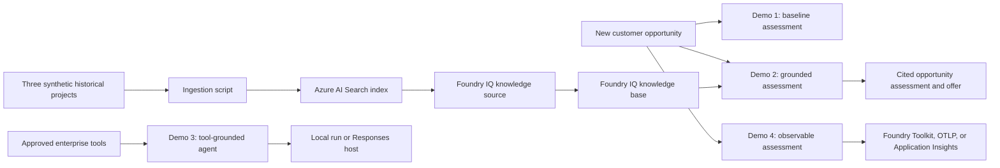

# Opportunity Assessment Agent

A compact Microsoft Agent Framework and Microsoft Foundry demo for turning a customer opportunity into an enterprise-ready solution assessment. The samples show the progression from model-only reasoning to organizational grounding with Foundry IQ, enterprise tools, hosted execution, and observability.

The included healthcare records and opportunity details are synthetic. The project is intended for demonstrations and learning, not as production clinical software.

> Foundry IQ integration uses the `2026-05-01-preview` Azure AI Search API and a beta Azure Search SDK. Review preview compatibility before production use.

## What this repository demonstrates

1. **Single-agent assessment** - Creates a concise opportunity brief from a customer scenario.
2. **Foundry IQ grounding** - Ingests three structured historical projects into Azure AI Search and retrieves similar delivery experience for a grounded offer.
3. **Enterprise tools and hosting** - Grounds an agent in CRM, architecture, and cost-profile tools and can expose the agent through the Foundry Responses protocol.
4. **Evaluation and tracing** - Exports Agent Framework traces and records a simple enterprise-coverage score.

## How it works



The Foundry IQ path is deliberately separate from model generation:

- `ingest_foundry_iq.py` validates three sample projects, creates or updates a semantic Search index, uploads the records, and creates the Foundry IQ knowledge source and knowledge base.
- `02_patterns.py` retrieves similar projects from the knowledge base with extractive data and native reference IDs.
- The assessment agent receives both the new opportunity and retrieved evidence. Historical claims must use citations such as `[0]`, while unsupported choices are labeled as recommendations or assumptions.

## Repository layout

| Path | Purpose |
| --- | --- |
| `kickoffdemos/01_intro.py` | Baseline single-agent opportunity assessment |
| `kickoffdemos/ingest_foundry_iq.py` | Three-document Azure AI Search and Foundry IQ ingestion |
| `kickoffdemos/02_patterns.py` | Before/after assessment grounded in past projects |
| `kickoffdemos/03_hosted_tools.py` | Enterprise tool calling and optional Responses host |
| `kickoffdemos/04_observability.py` | Tracing and a custom coverage score |
| `tests/test_demo_contracts.py` | Offline regression tests for ingestion, authentication, cleanup, and story contracts |
| `DEMO_GUIDE.md` | Presenter runbook for the consistent four-demo story |
| `.env.example` | Safe configuration template |
| `requirements.txt` | Base dependencies for local demos |
| `requirements-hosted.txt` | Optional prerelease dependency for Demo 3 hosted mode |

## Prerequisites

- Python 3.12 (the validated version)
- Azure CLI
- A Microsoft Foundry project with an accessible model deployment
- An Azure AI Search service for the Foundry IQ demo
- Either:
  - a Search connection in the Foundry project, or
  - Azure RBAC access to a Search endpoint for the signed-in Azure CLI identity
- Optional: Application Insights, an OTLP endpoint, or the Foundry Toolkit trace viewer for Demo 4

Live model, Search, and telemetry calls may incur Azure charges.

## Setup

From the repository root in PowerShell:

```powershell
python -m venv .venv
.\.venv\Scripts\Activate.ps1
python -m pip install -r requirements.txt
az login
Copy-Item .env.example .env
```

On macOS or Linux, activate with `source .venv/bin/activate` and copy the environment template with `cp .env.example .env`.

Edit `.env` with your resource names. Never commit `.env` or credentials.

## Configuration

| Variable | Used by | Description |
| --- | --- | --- |
| `FOUNDRY_PROJECT_ENDPOINT` | All model demos; Search connection mode | Foundry project endpoint |
| `AZURE_AI_MODEL_DEPLOYMENT_NAME` | Demos 1-4 | Model deployment name |
| `FOUNDRY_IQ_SEARCH_CONNECTION_NAME` | Ingestion and Demo 2 | Foundry project Search connection; required unless a direct Search endpoint is set |
| `FOUNDRY_IQ_SEARCH_ENDPOINT` | Ingestion and Demo 2 | Optional direct Search endpoint using `AzureCliCredential` |
| `AZURE_SEARCH_ENDPOINT` | Ingestion and Demo 2 | Alias for the direct Search endpoint |
| `FOUNDRY_IQ_OPPORTUNITY_INDEX_NAME` | Ingestion | Optional index-name override |
| `FOUNDRY_IQ_OPPORTUNITY_KNOWLEDGE_SOURCE_NAME` | Ingestion and Demo 2 | Optional knowledge-source override |
| `FOUNDRY_IQ_OPPORTUNITY_KNOWLEDGE_BASE_NAME` | Ingestion and Demo 2 | Optional knowledge-base override |
| `APPLICATIONINSIGHTS_CONNECTION_STRING` | Demo 4 | Optional Application Insights export |
| `OTEL_EXPORTER_OTLP_ENDPOINT` | Demo 4 | Optional generic OpenTelemetry export |

`AZURE_AI_PROJECT_ENDPOINT`, `project_endpoint`, `FOUNDRY_MODEL`, and `deployment_name` remain supported aliases in the sample code.

### Search authentication

The ingestion and retrieval scripts support two modes:

- **Foundry connection:** Set `FOUNDRY_PROJECT_ENDPOINT` and `FOUNDRY_IQ_SEARCH_CONNECTION_NAME`. The scripts resolve the Search endpoint from that project connection. Key-based connections use their in-memory key; keyless connections use `AzureCliCredential` and require the signed-in identity to have the appropriate Azure AI Search roles.
- **Direct endpoint:** Set `FOUNDRY_IQ_SEARCH_ENDPOINT` or `AZURE_SEARCH_ENDPOINT`. The scripts use `AzureCliCredential`; assign the signed-in identity the appropriate Azure AI Search roles for index management, document upload, and retrieval.

The default persistent resource names are:

- Index: `si-healthcare-opportunity-history`
- Knowledge source: `si-healthcare-opportunity-history-ks`
- Knowledge base: `si-healthcare-opportunity-assessment-kb`

Running ingestion again updates these resources and uploads the same three document IDs, making the operation idempotent.

## Run the Foundry IQ scenario

Validate the sample records without contacting Azure:

```powershell
python -B kickoffdemos/ingest_foundry_iq.py --dry-run
```

Create or update the index, documents, knowledge source, and knowledge base:

```powershell
python -B kickoffdemos/ingest_foundry_iq.py
```

Run the baseline assessment:

```powershell
python -B kickoffdemos/01_intro.py
```

Run the grounded before/after assessment:

```powershell
python -B kickoffdemos/02_patterns.py
```

For a presentation with pauses and follow-up questions:

```powershell
python -B kickoffdemos/02_patterns.py --pause --interactive
```

You can pass a different opportunity as the positional argument. Retrieval quality depends on its similarity to the three healthcare projects.

## Run the remaining demos

Run the tool-grounded agent locally:

```powershell
python -B kickoffdemos/03_hosted_tools.py
```

Hosted mode uses a prerelease package and requires a configured Foundry Hosted Agent environment:

```powershell
python -m pip install -r requirements-hosted.txt
python -B kickoffdemos/03_hosted_tools.py --serve
```

Run the observable assessment:

```powershell
python -B kickoffdemos/04_observability.py
```

Prompt and completion content capture is disabled by default. Use `--include-content` only with non-sensitive data and an approved telemetry destination.

## Test offline contracts

After installing the base requirements, run the standard-library `unittest` suite without contacting Azure:

```powershell
python -B -m unittest discover -s tests -v
```

The suite checks the three-document ingestion contract, key and keyless Search connections, retrieval-client cleanup, untrusted-evidence instructions, disabled response storage, the shared Contoso opportunity, and the Demo 4 coverage criteria.

## Operational notes

- The ingestion records are synthetic and contain no patient data.
- Retrieved documents are treated as evidence, not executable instructions.
- The opportunity assessment keeps clinician approval as a mandatory boundary.
- Stateless agent calls set `store=False` so model responses are not stored by the Responses API.
- Search and knowledge resources persist after the scripts exit; this repository does not delete Azure resources.
- The custom Demo 4 coverage score checks for expected phrases. It is illustrative, not a production quality or safety evaluation.
- Review identity, networking, content safety, evaluations, error handling, and lifecycle management before adapting these samples for production.

## Public release checklist

- Confirm `.env`, caches, traces, and credentials are not staged.
- Review all resource names and sample content for your organization.
- Run the dry run and all `--help` commands in a clean environment.
- Run live ingestion and Demo 2 against a non-production Azure environment.
- Review the preview SDK/API pins before upgrading.
- Add a license approved by your organization before publishing. No license is included because license selection is a legal/project-owner decision.

## References

- [Microsoft Agent Framework documentation](https://learn.microsoft.com/agent-framework/)
- [Microsoft Foundry documentation](https://learn.microsoft.com/azure/ai-foundry/)
- [Azure AI Search documentation](https://learn.microsoft.com/azure/search/)
- [Azure Identity documentation](https://learn.microsoft.com/python/api/overview/azure/identity-readme)
